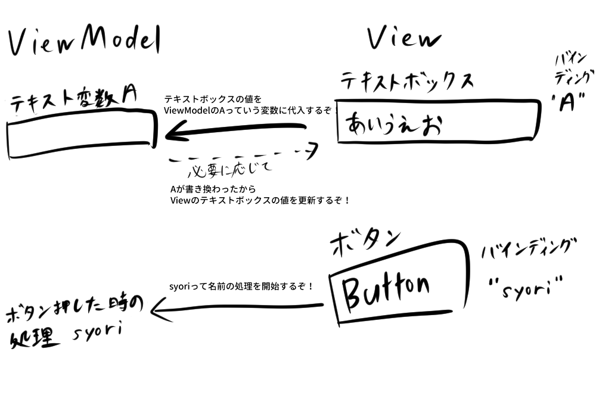

# はじめに
このチュートリアルはプログラミング初心者向けに、Windows,Mac,Linuxで動作するデスクトップアプリを作成する際の雰囲気を掴んでもらうために作成しました。プログラミングの経験がある方には粗さが目立つかもしれませんが、どうか温かい目でご覧ください。そうでない方には、是非ともC#+Avaloniaを用いたデスクトップアプリケーションというものを楽しんでいただければ幸いです。

今回はプログラミング言語にC#、ウィンドウやボタンといったGUIの表示にAvalonia（アバロニア）というライブラリを使用します。なので道中どこかで詰まるところがあれば、GoogleやチャットAIで「C# ●●(困ったこと)」「Avalonia ●●」と検索すれば、解決策が見つかるはずです。

[!WARNING]
2025年5月時点のChatGPT無料版で使えるモデルでは、ほとんどAvaloniaの知識を学習していないようです。ChatGPT無料版にAvaloniaについて質問すると大嘘をつかれる可能性があるため、より最新の情報を学習しているGPT4.1やGemini、DeepSeekなどを利用することをお勧めします。

# どんなアプリを作るの？
非常にシンプルなランチャーアプリを作ります。

実行ファイルと同じ場所にあるjsonファイルでアイテムを登録してからアプリを起動すると、左のリストから選択して起動することができます。
機能は激ショボですが、その分少ない手数で作れます。
# 環境構築

C#プログラムを開発するために、パソコンに.NET SDKというソフトウェアをインストールする必要があります。
### .NET SDKのインストール方法
1. [Microsoft公式サイト](https://dotnet.microsoft.com/download)にアクセス
2. 「.NET SDK」をダウンロード
3. ダウンロードしたインストーラーを実行し、ぽちぽちっとインストール

インストールが終わったあと、ターミナルに`dotnet -h`と入力して、ながったらしい説明が出れば正常に動作しています。

次にコードを書くためのエディタを導入します。VisualStudioCodeやEclipseなどが有名です。今回はよりC#の開発に向いた「統合開発環境（IDE）」であるJetBrains Riderを導入します。Riderは少し前まで有料だったのですが、最近になり非商用利用であれば無料で使えるようになりました。もちろんVSCodeで書き進めても大丈夫です。


### JetBrains Riderのインストール方法
1. [JetBrains公式サイト](https://www.jetbrains.com/ja-jp/rider/)にアクセスしてダウンロード
2. ダウンロードしたインストーラーを実行し、ぽちぽちっとインストール
3. アカウント登録とかもありますが、そこは難しくないので頑張って！
4. 起動して「プラグイン」の画面を開きます

5. 「AvaloniaRider」プラグインをインストールする


AvaloniaRiderプラグインは、Rider内でAvaloniaで作ったUIをリアルタイムに確認したり、1クリックでUIのテンプレートファイルを作成したりといった機能を追加するプラグインです。

# プロジェクト作成
パソコンの適当な場所に、プログラムのコードを保存するフォルダを作成してください。
次に、コマンドプロンプト（ターミナル）を開いて、作成したフォルダに移動します。

移動した後、以下を入力し、Avaloniaを使ったプロジェクトのテンプレートをインストールします。

```bash
dotnet new install Avalonia.Templates
```
それではこのテンプレートを使い、新しいプロジェクトをテンプレートから作成します。

```bash
dotnet new avalonia.mvvm --mvvm ReactiveUI
```
先ほどインストールしたAvaloniaプロジェクトのテンプレートはいくつか存在します。[こちら](https://github.com/AvaloniaUI/avalonia-dotnet-templates)で確認することができます。
今回用いたものは「MVVMパターン」「MVVMライブラリはReactiveUI」を用いるというものです。MVVMとはModel-View-ViewModelというGUIアプリ設計手法のことで、このあと説明していきます。


作成したプロジェクトをRiderで開きます。起動して右上にある「開く」ボタンを押すと、フォルダを選択するダイアログが出現します。ここで先ほど作成したフォルダを選択して開いてください。


開くとこのような画面が表示されるはずです。

# とりあえずテンプレートのまま実行してみよう
テンプレートからプロジェクトを作成したので、何も編集しない状態でも実行するとウィンドウが表示されます。

Riderの画面右上にある再生ボタンのようなものを押してみてください。ソースコードからアプリがビルドされて実行されるはずです。

Welcome to Avalonia!

# テンプレートのコードを見る

Riderの画面左側には、プロジェクトのソースコードが並んでいます。テンプレートから作成したので、最初から複数のソースコードが並んでいます。アイコンの左に>のようなマークがついているものは、>をクリックすることで中に含まれるファイルを表示することができます。

プログラムはおおよそ
Program.cs→App.axaml.cs→MainWindowViewModel.cs→MainWindow.axaml.cs
の順に実行されます。Avaloniaプロジェクトでは、Program.csの内容を編集することは基本的にありませんし、App.axaml.csも、ちょっと特殊なことをしようとしなければ編集する必要はありません。

Viewsフォルダ内にある`MainWindow.axaml`を開いてみてください。

ここでは、xmlというマークアップ言語で、アプリを起動して最初に表示されるウィンドウの内容を定義しています。
先ほど表示されたWelcome to Avalonia!という文字も、TextBoxで定義されて...いないですね？
ここで先ほど少し書いたプレビューを表示してみます。

画像矢印で書いた「エディターとプレビュー」ボタンを押すと、画面下部にWelcome to Avalonia!の文字に白背景のプレビューが表示されるかと思います。
ですがxml内にWelcome to Avaloniaの文字は書かれていません。この文字は`MainWindowViewModel.cs`で定義されています。
ViewModelsフォルダの中にある`MainWindowViewModel.cs`を開いてみてください。

```csharp
namespace kariLauncher.ViewModels;

public class MainWindowViewModel : ViewModelBase
{
    public string Greeting { get; } = "Welcome to Avalonia!";
}
```

MainWindowViewModel.csの中身はこのようになっているはずです。
意味を適当に説明すると、このようになります。
```csharp
// 複数プロジェクトに分かれたコードを識別するための符号的なやつ
namespace kariLauncher.ViewModels;

// 他のクラスから見える形でMainWindowViewModelという名前のクラスを作る ViewModelBaseクラスから派生する
public class MainWindowViewModel : ViewModelBase
{
    // Greetingという名前の文字列変数をクラス外からでも見えるように定義する
    public string Greeting { get; } = "Welcome to Avalonia!";
}
```
C#はオブジェクト指向といって、プログラムを**クラス**というデータの設計図っぽいものを組み合わせて表現していきます。このクラスはそれ単体だと設計図に過ぎないので、どこかでクラスから実際のデータを生成（インスタンス化）して動かします。

が私よりChatGPTに「C#のオブジェクト指向について説明して」と聞いたほうが10000000000倍良い説明になると思うのでそっちに聞いてください！

本チュートリアルのうちはオブジェクト指向のことは「ふ～ん（存在だけはわかる）」くらいの理解度で大丈夫です（正直、私もそのくらいの理解度）。

ちなみに今回のAvaloniaテンプレートでは、MainWindowViewModelクラスのインスタンス化はApp.axaml.csで行われています。

MainWindow.axamlに戻ります。
```xml
<Window xmlns="https://github.com/avaloniaui"
        xmlns:x="http://schemas.microsoft.com/winfx/2006/xaml"
        xmlns:vm="using:kariLauncher.ViewModels"
        xmlns:d="http://schemas.microsoft.com/expression/blend/2008"
        xmlns:mc="http://schemas.openxmlformats.org/markup-compatibility/2006"
        mc:Ignorable="d" d:DesignWidth="800" d:DesignHeight="450"
        x:Class="kariLauncher.Views.MainWindow"
        x:DataType="vm:MainWindowViewModel"
        Icon="/Assets/avalonia-logo.ico"
        Title="kariLauncher">

    <Design.DataContext>
        <!-- This only sets the DataContext for the previewer in an IDE,
             to set the actual DataContext for runtime, set the DataContext property in code (look at App.axaml.cs) -->
        <vm:MainWindowViewModel/>
    </Design.DataContext>

    <TextBlock Text="{Binding Greeting}" HorizontalAlignment="Center" VerticalAlignment="Center"/>

</Window>
```

真ん中くらいで`x:DataType="vm:MainWindowViewModel"`と書かれています。これはこのウィンドウの**ViewModel**（後述）を`MainWindowViewModel`と指定しているということです。
そして肝心のTextBlockには`Text="{Binding Greeting}"`と書いてあります。これは先ほどの`MainWindowViewModel`にあった文字列変数`Greeting`を、テキストブロックで表示する文字とするということです。

なので、Greeting変数を変更すると表示内容も書き換わります。
MainWindowViewModel.csを編集して
```csharp
public string Greeting { get; } = "あばばばばばばばばばばば";
```
としてから起動しなおすと、ウィンドウの文字も「あばばばばばばばばばばば」に変わります。

# MVVMとは？
GUIを持ったアプリを開発する際の設計思想のひとつに**MVVM**というものがあります。
超ざっくり表現すると、MVVMはModel View ViewModelの略で、プログラムを「処理やデータ(Model)」「表示(View)」「表示と処理の間に挟まって仲介したり表示用データを準備したりするやつ(ViewModel)」の3つに分けて開発するという考え方です。

ModelとViewをがっちり結合するようなプログラムは、小規模であったり使い捨てたりするようなプログラムでは問題になりません。しかし規模の大きいプログラムとなると、見た目か処理のどちらかを変えようとするだけでも、両方の変更が絡み合い、コードが複雑になりやすいという問題があります。
さらに、コードに対するテストを作成することも難しくなります。例えば、ボタンを押すと実行される処理が正しく実行されるかをテストするには、テスト時にウィンドウを開き、ボタンを押すというめんどくさいテストを書く必要が生じてしまいます。

そこでプログラム全体をModel,View,ViewModelの3つに分けて開発するという考え方が、デスクトップアプリを作成する際の設計思想として広まりました。ModelとViewを完全に分離したうえで、両者の橋渡しをするViewModelを用いることで、コード変更の影響を最小限に抑え、コードのテストも容易になります。GUIライブラリAvaloniaでは、このMVVMの考え方を採用しています。

似たような概念として、「MVC(Model View Controller)」や、「MVP(Model View Presenter)」などがあります。興味を持った方は調べてみてね！~~私もあまり違いがわからず説明できない~~

先ほど作成したテンプレートプロジェクトでは、Model相当のプログラムは用意されておらず、Viewが`MainWindow.axaml`、ViewModelが`MainWindowViewModel.cs`となっています。
Avaloniaを始めとするMVVMを前提としたライブラリでは、ViewとViewModelの接続を簡単にするために「バインディング」という仕組みが存在します。
```csharp
<TextBlock Text="{Binding Greeting}" HorizontalAlignment="Center" VerticalAlignment="Center"/>
```
このなかの`Text="{Binding Greeting}"`という部分が、まさにバインディングを使っている部分となります。

画像はバインディングの概要を、例を出して大雑把に説明しようとして描いたものです。
「ViewModelとView間の接続をかんたんに書けるよ！」くらいの感覚で大丈夫です。

# リスト状に表示してみる
それではここから、ランチャーアプリを順を追って作成していきます。
まずはMainWindow.axamlをどのように編集すればいいのかを確かめてみましょう。
```xml
<Window xmlns="https://github.com/avaloniaui"
        省略
        Title="kariLauncher">

    <Design.DataContext>
        省略
    </Design.DataContext>
    
    <TextBlock Text="{Binding Greeting}" HorizontalAlignment="Center" VerticalAlignment="Center"/>
    <TextBlock Text="あいうえお"/>
    <TextBlock Text="かきくけこ"/>
    <TextBlock Text="さしすせそ"/>

</Window>
```
というわけで適当にテキストブロックを連続で配置！
は`プロパティ Content は複数回設定されています`というエラーが出てしまうので不可能です。

テキストブロックや画像、ボタンといったUI要素を「**コントロール**」といいます。このコントロールなのですが、実はWindowタグ内に同時に1つまでしか配置することができません。
ではウィンドウに複数のUI要素を配置するにはどうするのかというと、「**パネル**」と呼ばれる種類のコントロールを使います。このパネルは同時に複数のコントロールを配置することができるので、Windowタグ内にパネルを1つ配置し、その中にコントロールを複数個どんどん配置していくという流れになります。
パネルの種類は標準でたくさん用意されています。[Avaloniaの公式ドキュメント](https://docs.avaloniaui.net/docs/reference/controls/panel)を確認してみてください。

今回は格子状にコントロールを配置できる「Grid」という種類のパネルを使います。

```xml
<Window xmlns="https://github.com/avaloniaui"
        省略
        Title="kariLauncher">

    <Design.DataContext>
        省略
    </Design.DataContext>
    
    <Grid>
        <TextBlock Text="{Binding Greeting}"/>
        <TextBlock Text="あいうえお"/>
        <TextBlock Text="かきくけこ"/>
        <TextBlock Text="さしすせそ"/>
    </Grid>

</Window>
```
すると今度はエラー無く、複数のテキストブロックを配置することができました！

しかしプレビュー画面を見てみると、位置を中心寄りになるよう設定している最初のテキストブロック以外の3つが、ウィンドウ左上で重なっているようです。
これは、Gridの定義を行っていないために発生しています。

次のように、MainWindow.axamlを編集してください。
```xml
<Window xmlns="https://github.com/avaloniaui"
        省略
        Title="kariLauncher">

    <Design.DataContext>
        省略
    </Design.DataContext>
    
    <Grid>
        <Grid.RowDefinitions>
            <RowDefinition Height="Auto"/>
            <RowDefinition Height="Auto"/>
            <RowDefinition Height="Auto"/>
            <RowDefinition Height="Auto"/>
        </Grid.RowDefinitions>
        <TextBlock Grid.Row="0" Text="{Binding Greeting}" HorizontalAlignment="Center" VerticalAlignment="Center"/>
        <TextBlock Grid.Row="1" Text="あいうえお"/>
        <TextBlock Grid.Row="2" Text="かきくけこ"/>
        <TextBlock Grid.Row="3" Text="さしすせそ"/>
    </Grid>

</Window>
```
詳細は省きます（ChatGPTに聞け！）が、グリッドの行定義と、各テキストブロックをそれぞれどの行に配置するかを書くようにしました。

すると、各テキストブロックが重ならないように配置されましたね！

グリッドによる場所の指定は、どのような状態でも位置や数が変わらないような場面で有効ですが、今回作成するランチャーアプリでは、登録したアプリの数によって、表示するコントロールの数は変動します。数は可変だが似たようなものを列挙するには、ListBoxというコントロールを用いると便利です。

ListBoxを使った書き方をすると、次のようになります。
```xml
<Window xmlns="https://github.com/avaloniaui"
        省略
        Title="kariLauncher">

    <Design.DataContext>
        省略
    </Design.DataContext>
    
    <ListBox>
        <ListBoxItem>
            <TextBlock Grid.Row="0" Text="{Binding Greeting}" HorizontalAlignment="Center" VerticalAlignment="Center"/>
        </ListBoxItem>
        <ListBoxItem>
            <TextBlock Text="あいうえお" />
        </ListBoxItem>
        <ListBoxItem>
            <TextBlock Text="かきくけこ" />
        </ListBoxItem>
        <ListBoxItem>
            <TextBlock Text="さしすせそ" />
        </ListBoxItem>
    </ListBox>

</Window>
```


今はMainWindow.axamlだけを編集しているのでわかりにくいのですが、ListBoxはViewModel側からアイテムを追加したり削除したりということが非常にやりやすくなっています。さらに、選択しているアイテムをViewModelから取得することだって簡単に行えます。