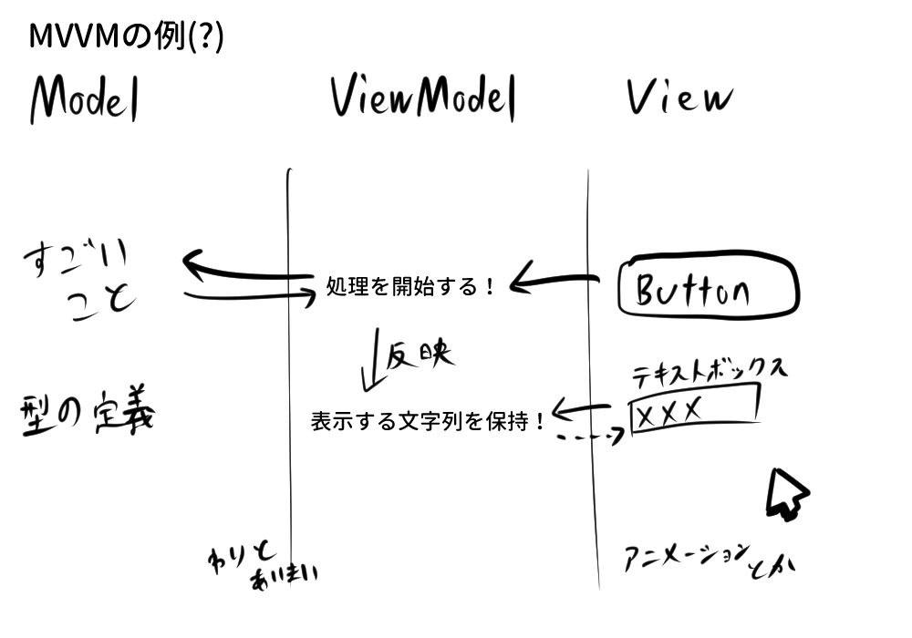

# はじめに
このチュートリアルはプログラミング初心者向けに、Windows,Mac,Linuxで動作するデスクトップアプリを作成する際の雰囲気を掴んでもらうために作成しました。プログラミングの経験がある方には粗さが目立つかもしれませんが、どうか温かい目でご覧ください。そうでない方には、是非ともC#+Avaloniaを用いたデスクトップアプリケーションというものを楽しんでいただければ幸いです。

今回はプログラミング言語にC#、ウィンドウやボタンといったGUIの表示にAvalonia（アバロニア）というライブラリを使用します。なので道中どこかで詰まるところがあれば、GoogleやチャットAIで「C# ●●(困ったこと)」「Avalonia ●●」と検索すれば、解決策が見つかるはずです。

本チュートリアルでは時折コードの意味の説明を行いますが、覚える必要は全くありません。コードは「ふーん」くらいで流し読みしながら、実際にエディタを開いてコードを写してみてください。

> [!WARNING]
> 2025年5月時点のChatGPT無料版で使えるモデルでは、ほとんどAvaloniaの知識を学習していないようです。ChatGPT無料版にAvaloniaについて質問すると大嘘をつかれる可能性があるため、より最新の情報を学習しているGPT4.1やGemini、DeepSeekなどを利用することをお勧めします。

# 目次

- [はじめに](#はじめに)
- [どんなアプリを作るの？](#どんなアプリを作るの)
- [環境構築](#環境構築)
  - [.NET SDKのインストール方法](#net-sdkのインストール方法)
  - [JetBrains Riderのインストール方法](#jetbrains-riderのインストール方法)
- [プロジェクト作成](#プロジェクト作成)
- [とりあえずテンプレートのまま実行してみよう](#とりあえずテンプレートのまま実行してみよう)
- [テンプレートのコードを見る](#テンプレートのコードを見る)
- [MVVMとは？](#mvvmとは)
- [リスト状に表示してみる](#リスト状に表示してみる)
- [コントロールを作る](#コントロールを作る)
- [リストxデータバインディング](#リストxデータバインディング)
- [画面右を作る](#画面右を作る)
- [ボタンを押してアプリを起動させる](#ボタンを押してアプリを起動させる)
- [便利なコンバーター](#便利なコンバーター)
- [次はどうしたらいい？](#次はどうしたらいい)
- [参考になりそうなウェブサイト](#参考になりそうなウェブサイト)

# どんなアプリを作るの？
非常にシンプルなランチャーアプリを作ります。

左のリストからアプリを選択し、起動することができます。
機能は激ショボですが、その分少ない手数で作れます。
https://github.com/SousiOmine/WelcomeAvalonia/tree/main/WelcomeAvaloniaLauncher
で、かんたんな説明付きの完成品コードを確認できます。
こちらの完成品では、jsonファイルからアプリリストを読み込む機能もおまけでついています。
# 環境構築

C#プログラムを開発するために、パソコンに.NET SDKというソフトウェアをインストールする必要があります。
### .NET SDKのインストール方法
1. [Microsoft公式サイト](https://dotnet.microsoft.com/download)にアクセス
2. 「.NET SDK」をダウンロード
3. ダウンロードしたインストーラーを実行し、ぽちぽちっとインストール

インストールが終わったあと、ターミナルに`dotnet -h`と入力して、ながったらしい説明が出れば正常に動作しています。

次にコードを書くためのエディタを導入します。VisualStudioCodeやEclipseなどが有名です。今回はよりC#の開発に向いた「統合開発環境（IDE）」であるJetBrains Riderを導入します。Riderは少し前まで有料だったのですが、最近になり非商用利用であれば無料で使えるようになりました。もちろんVSCodeで書き進めても大丈夫です。


### JetBrains Riderのインストール方法
1. [JetBrains公式サイト](https://www.jetbrains.com/ja-jp/rider/)にアクセスしてダウンロード
2. ダウンロードしたインストーラーを実行し、ぽちぽちっとインストール
3. アカウント登録とかもありますが、そこは難しくないので頑張って！
4. 起動して「プラグイン」の画面を開きます

5. 「AvaloniaRider」プラグインをインストールする


AvaloniaRiderプラグインは、Rider内でAvaloniaで作ったUIをリアルタイムに確認したり、1クリックでUIのテンプレートファイルを作成したりといった機能を追加するプラグインです。

# プロジェクト作成
パソコンの適当な場所に、プログラムのコードを保存するフォルダを作成してください。
次に、コマンドプロンプト（ターミナル）を開いて、作成したフォルダに移動します。

移動した後、以下を入力し、Avaloniaを使ったプロジェクトのテンプレートをインストールします。

```bash
dotnet new install Avalonia.Templates
```
それではこのテンプレートを使い、新しいプロジェクトをテンプレートから作成します。

```bash
dotnet new avalonia.mvvm --mvvm ReactiveUI
```
先ほどインストールしたAvaloniaプロジェクトのテンプレートはいくつか存在します。[こちら](https://github.com/AvaloniaUI/avalonia-dotnet-templates)で確認することができます。
今回用いたものは「MVVMパターン」「MVVMライブラリはReactiveUI」を用いるというものです。MVVMとはModel-View-ViewModelというGUIアプリ設計手法のことで、このあと説明していきます。


作成したプロジェクトをRiderで開きます。起動して右上にある「開く」ボタンを押すと、フォルダを選択するダイアログが出現します。ここで先ほど作成したフォルダを選択して開いてください。


開くとこのような画面が表示されるはずです。

# とりあえずテンプレートのまま実行してみよう
テンプレートからプロジェクトを作成したので、何も編集しない状態でも実行するとウィンドウが表示されます。

Riderの画面右上にある再生ボタンのようなものを押してみてください。ソースコードからアプリがビルドされて実行されるはずです。

Welcome to Avalonia!

# テンプレートのコードを見る

Riderの画面左側には、プロジェクトのソースコードが並んでいます。テンプレートから作成したので、最初から複数のソースコードが並んでいます。アイコンの左に>のようなマークがついているものは、>をクリックすることで中に含まれるファイルを表示することができます。

プログラムはおおよそ
Program.cs→App.axaml.cs→MainWindowViewModel.cs→MainWindow.axaml.cs
の順に実行さていきます。Avaloniaプロジェクトでは、Program.csの内容を編集することは基本的にありませんし、App.axaml.csも、ちょっと特殊なことをしようとしなければ編集する必要はありません。

Viewsフォルダ内にある`MainWindow.axaml`を開いてみてください。

ここでは、xmlというマークアップ言語で、アプリを起動して最初に表示されるウィンドウの内容を定義しています。
先ほど表示されたWelcome to Avalonia!という文字も、TextBoxで定義されて...いないですね？
ここで先ほど少し書いたプレビューを表示してみます。

画像矢印で書いた「エディターとプレビュー」ボタンを押すと、画面下部にWelcome to Avalonia!の文字に白背景のプレビューが表示されるかと思います。
ですがxml内にWelcome to Avaloniaの文字は書かれていません。この文字は`MainWindowViewModel.cs`で定義されています。
ViewModelsフォルダの中にある`MainWindowViewModel.cs`を開いてみてください。

```csharp
namespace kariLauncher.ViewModels;

public class MainWindowViewModel : ViewModelBase
{
    public string Greeting { get; } = "Welcome to Avalonia!";
}
```

MainWindowViewModel.csの中身はこのようになっているはずです。
意味を適当に説明すると、このようになります。
```csharp
// 複数プロジェクトに分かれたコードを識別するための符号的なやつ
namespace kariLauncher.ViewModels;

// 他のクラスから見える形でMainWindowViewModelという名前のクラスを作る ViewModelBaseクラスから派生する
public class MainWindowViewModel : ViewModelBase
{
    // Greetingという名前の文字列変数をクラス外からでも見えるように定義する
    public string Greeting { get; } = "Welcome to Avalonia!";
}
```
C#はオブジェクト指向といって、プログラムを**クラス**というデータの設計図っぽいものを組み合わせて表現していきます。このクラスはそれ単体だと設計図に過ぎないので、どこかでクラスから実際のデータを生成（インスタンス化）して動かします。

が私よりChatGPTに「C#のオブジェクト指向について説明して」と聞いたほうが10000000000倍良い説明になると思うのでそっちに聞いてください！

本チュートリアルのうちはオブジェクト指向のことは「ふ～ん（存在だけはわかる）」くらいの理解度で大丈夫です（正直、私もそのくらいの理解度）。

ちなみに今回のAvaloniaテンプレートでは、MainWindowViewModelクラスのインスタンス化はApp.axaml.csで行われています。

MainWindow.axamlに戻ります。
```xml
<Window xmlns="https://github.com/avaloniaui"
        xmlns:x="http://schemas.microsoft.com/winfx/2006/xaml"
        xmlns:vm="using:kariLauncher.ViewModels"
        xmlns:d="http://schemas.microsoft.com/expression/blend/2008"
        xmlns:mc="http://schemas.openxmlformats.org/markup-compatibility/2006"
        mc:Ignorable="d" d:DesignWidth="800" d:DesignHeight="450"
        x:Class="kariLauncher.Views.MainWindow"
        x:DataType="vm:MainWindowViewModel"
        Icon="/Assets/avalonia-logo.ico"
        Title="kariLauncher">

    <Design.DataContext>
        <!-- This only sets the DataContext for the previewer in an IDE,
             to set the actual DataContext for runtime, set the DataContext property in code (look at App.axaml.cs) -->
        <vm:MainWindowViewModel/>
    </Design.DataContext>

    <TextBlock Text="{Binding Greeting}" HorizontalAlignment="Center" VerticalAlignment="Center"/>

</Window>
```

真ん中くらいで`x:DataType="vm:MainWindowViewModel"`と書かれています。これはこのウィンドウの**ViewModel**（後述）を`MainWindowViewModel`と指定しているということです。
そして肝心のTextBlockには`Text="{Binding Greeting}"`と書いてあります。これは先ほどの`MainWindowViewModel`にあった文字列変数`Greeting`を、テキストブロックで表示する文字とするということです。

なので、Greeting変数を変更すると表示内容も書き換わります。
MainWindowViewModel.csを編集して
```csharp
public string Greeting { get; } = "あばばばばばばばばばばば";
```
としてから起動しなおすと、ウィンドウの文字も「あばばばばばばばばばばば」に変わります。

# MVVMとは？
GUIを持ったアプリを開発する際の設計思想のひとつに**MVVM**というものがあります。
超ざっくり表現すると、MVVMはModel View ViewModelの略で、プログラムを「処理やデータ(Model)」「表示(View)」「表示と処理の間に挟まって仲介したり表示用データを準備したりするやつ(ViewModel)」の3つに分けて開発するという考え方です。



ModelとViewをがっちり結合するようなプログラムは、小規模であったり使い捨てたりするようなプログラムでは問題になりません。しかし規模の大きいプログラムとなると、見た目か処理のどちらかを変えようとするだけでも、両方の変更が絡み合い、コードが複雑になりやすいという問題があります。
さらに、コードに対するテストを作成することも難しくなります。例えば、ボタンを押すと実行される処理が正しく実行されるかをテストするには、テスト時にウィンドウを開き、ボタンを押すというめんどくさいテストを書く必要が生じてしまいます。

そこでプログラム全体をModel,View,ViewModelの3つに分けて開発するという考え方が、デスクトップアプリを作成する際の設計思想として広まりました。ModelとViewを完全に分離したうえで、両者の橋渡しをするViewModelを用いることで、コード変更の影響を最小限に抑え、コードのテストも容易になります。GUIライブラリAvaloniaでは、このMVVMの考え方を採用しています。

似たような概念として、「MVC(Model View Controller)」や、「MVP(Model View Presenter)」などがあります。興味を持った方は調べてみてね！~~これらと比較するとMVVMはViewとViewModelの間の結合がかなり弱いという特徴があったりします。たとえばMVCだとControllerはViewを知ることは許容されるのですがMVVMではViewModelがViewを知ることは厳禁だったりと。いろいろ書いたけどMVVMは私もあまり違いがわからず説明できない~~

先ほど作成したテンプレートプロジェクトでは、Model相当のプログラムは用意されておらず、Viewが`MainWindow.axaml`、ViewModelが`MainWindowViewModel.cs`となっています。
Avaloniaを始めとするMVVMを前提としたライブラリでは、ViewとViewModelの接続を簡単にするために「バインディング」という仕組みが存在します。
```csharp
<TextBlock Text="{Binding Greeting}" HorizontalAlignment="Center" VerticalAlignment="Center"/>
```
このなかの`Text="{Binding Greeting}"`という部分が、まさにバインディングを使っている部分となります。

画像はバインディングの概要を、例を出して大雑把に説明しようとして描いたものです。
「ViewModelとView間の接続をかんたんに書けるよ！」くらいの感覚で大丈夫です。

# リスト状に表示してみる
それではここから、ランチャーアプリを順を追って作成していきます。
まずはMainWindow.axamlをどのように編集すればいいのかを確かめてみましょう。
```xml
<Window xmlns="https://github.com/avaloniaui"
        省略
        Title="kariLauncher">

    <Design.DataContext>
        省略
    </Design.DataContext>
    
    <TextBlock Text="{Binding Greeting}" HorizontalAlignment="Center" VerticalAlignment="Center"/>
    <TextBlock Text="あいうえお"/>
    <TextBlock Text="かきくけこ"/>
    <TextBlock Text="さしすせそ"/>

</Window>
```
というわけで適当にテキストブロックを連続で配置！
は`プロパティ Content は複数回設定されています`というエラーが出てしまうので不可能です。

テキストブロックや画像、ボタンといったUI要素を「**コントロール**」といいます。このコントロールなのですが、実はWindowタグ内に同時に1つまでしか配置することができません。
ではウィンドウに複数のUI要素を配置するにはどうするのかというと、「**パネル**」と呼ばれる種類のコントロールを使います。このパネルは同時に複数のコントロールを配置することができるので、Windowタグ内にパネルを1つ配置し、その中にコントロールを複数個どんどん配置していくという流れになります。
パネルの種類は標準でたくさん用意されています。[Avaloniaの公式ドキュメント](https://docs.avaloniaui.net/docs/reference/controls/panel)を確認してみてください。

今回は格子状にコントロールを配置できる「Grid」という種類のパネルを使います。

```xml
<Window xmlns="https://github.com/avaloniaui"
        省略
        Title="kariLauncher">

    <Design.DataContext>
        省略
    </Design.DataContext>
    
    <Grid>
        <TextBlock Text="{Binding Greeting}"/>
        <TextBlock Text="あいうえお"/>
        <TextBlock Text="かきくけこ"/>
        <TextBlock Text="さしすせそ"/>
    </Grid>

</Window>
```
すると今度はエラー無く、複数のテキストブロックを配置することができました！

しかしプレビュー画面を見てみると、位置を中心寄りになるよう設定してある最初のテキストブロック以外の3つが、ウィンドウ左上で重なっているようです。
これは、Gridの定義を行っていないために発生しています。

次のように、MainWindow.axamlを編集してください。
```xml
<Window xmlns="https://github.com/avaloniaui"
        省略
        Title="kariLauncher">

    <Design.DataContext>
        省略
    </Design.DataContext>
    
    <Grid>
        <Grid.RowDefinitions>
            <RowDefinition Height="Auto"/>
            <RowDefinition Height="Auto"/>
            <RowDefinition Height="Auto"/>
            <RowDefinition Height="Auto"/>
        </Grid.RowDefinitions>
        <TextBlock Grid.Row="0" Text="{Binding Greeting}" HorizontalAlignment="Center" VerticalAlignment="Center"/>
        <TextBlock Grid.Row="1" Text="あいうえお"/>
        <TextBlock Grid.Row="2" Text="かきくけこ"/>
        <TextBlock Grid.Row="3" Text="さしすせそ"/>
    </Grid>

</Window>
```
詳細は省きます（ChatGPTに聞け！）が、グリッドの行定義と、各テキストブロックをそれぞれどの行に配置するかを書くようにしました。

すると、各テキストブロックが重ならないように配置されましたね！

グリッドによる場所の指定は、どのような状態でも位置や数が変わらないような場面で有効ですが、今回作成するランチャーアプリでは、登録したアプリの数によって、表示するコントロールの数は変動します。数は可変だが似たようなものを列挙するには、ListBoxというコントロールを用いると便利です。

ListBoxを使った書き方をすると、次のようになります。
```xml
<Window xmlns="https://github.com/avaloniaui"
        省略
        Title="kariLauncher">

    <Design.DataContext>
        省略
    </Design.DataContext>
    
    <ListBox>
        <ListBoxItem>
            <TextBlock Grid.Row="0" Text="{Binding Greeting}" HorizontalAlignment="Center" VerticalAlignment="Center"/>
        </ListBoxItem>
        <ListBoxItem>
            <TextBlock Text="あいうえお" />
        </ListBoxItem>
        <ListBoxItem>
            <TextBlock Text="かきくけこ" />
        </ListBoxItem>
        <ListBoxItem>
            <TextBlock Text="さしすせそ" />
        </ListBoxItem>
    </ListBox>

</Window>
```


今はMainWindow.axamlだけを編集しているのでわかりにくいのですが、ListBoxはViewModel側からアイテムを追加したり削除したりということが非常にやりやすくなっています。さらに、選択しているアイテムをViewModelから取得することだって簡単に行えます。

# コントロールを作る
先ほどはテキストブロックをそのままListBoxのアイテムとして配置してみました。

ここからは、完成後イメージの画面左側にあるアプリリストを作っていきます。こちらはアイテムによってアイコンやテキストが異なり、かつ登録されるアプリの数によってアイテムの数も増減します。

アプリリストのアイテム1つを定義するために必要な情報を考えます。無数にやりようはあるはずですが、本チュートリアルでは以下のように定義します。
- アイテム名（文字列）
- アイコンに使う画像のパス（文字列）
- アプリを起動するためのコマンド（文字列）

今回作成するランチャーでは、アプリの起動にコンソールに入力するコマンドを用います。たとえばWindowsでは、起動したいファイルのパスをコマンドプロンプトに入力するとそのアプリを起動することができますが、このコマンドをアイテムとしてそのまま登録し、C#コードから実行という~~手抜き~~超簡易実装を目指します。この実装では理論上、シェルスクリプトなども登録することができ自由度が高い一方、セキュリティ的にはかなりよくない実装でもあります。

これらを定義するためのクラスを作成します。
Modelsフォルダを右クリックし、追加→クラス/インターフェースをクリックしてください。

選択後に新しく作成するクラスの名前を決めるダイアログが出現するので、「Item」と入力しEnterを押してください。

すると、Modelsフォルダ内にItem.csというファイルが作成され、中身はこのようになっているはずです。
```csharp
namespace kariLauncher.Models;

public class Item
{
    
}
```
このItem.csを、以下のように編集してください。
```csharp
namespace kariLauncher.Models;

public class Item
{
    public string Title { get; set; } = string.Empty;
    public string IconPath { get; set; } = string.Empty;
    public string Command { get; set; } = string.Empty;
}
```
アイテム名とアイコン画像のパス、アプリ起動用のコマンドを格納する変数を定義しました。変数定義の右側にある`string.Empty`は、変数を定義する際に空の文字列を代入するためのものです。

次に、このItemクラスを表示するために、新しい「コントロール」を作成します。
コントロールは既存のコントロールを組み合わせて、新しいコントロールを作成することができるのです。
今回はItemViewという名前でコントロールを作成します。

Viewsフォルダを右クリックし、追加→Avalonia User Controlをクリックし、ファイル名を`ItemView.axaml`としてください。

作成後に今度はItemViewに対応するViewModelも同時に作成します。
ViewModelsフォルダを右クリックし、`ItemViewModel`クラスを作成してください。
作成されたItemViewModel.csを、以下のように編集してください。
```csharp
using System;
using Avalonia.Media.Imaging;
using kariLauncher.Models;

namespace kariLauncher.ViewModels;

public class ItemViewModel
{
    public Item Item { get; }
    public string Title { get; }
    public Bitmap? Icon { get; private set; }

    public ItemViewModel(Item targetItem)
    {
        Item = targetItem;
        Title = targetItem.Title;

        if (!string.IsNullOrEmpty(targetItem.IconPath))
        {
            try
            {
                Icon = new Bitmap(targetItem.IconPath);
            }
            catch (Exception e)
            {
                Console.WriteLine(e);
            }        
        }
    }
}
```
クラス外からも見える変数として、アイテムのデータを保持する`Item`、
アイテムの名前を公開する`Title`、
アイコン画像を保持する`Icon`を定義しました。

`public ItemViewModel(Item targetItem)`以降のコードはコンストラクタという、
新しいインスタンスを生成する際に一度だけ実行される特殊な処理です。
コンストラクタ内では、渡されたアイテムの内容を自身の変数に格納したり、
アイコン画像のパスから画像を読み込んだりしています。

それではこのItemViewModelの内容をViewで表示するために、ItemView.axamlを編集していきましょう。

```xml
<UserControl xmlns="https://github.com/avaloniaui"
             xmlns:x="http://schemas.microsoft.com/winfx/2006/xaml"
             xmlns:d="http://schemas.microsoft.com/expression/blend/2008"
             xmlns:mc="http://schemas.openxmlformats.org/markup-compatibility/2006"
             xmlns:vm="clr-namespace:kariLauncher.ViewModels"
             mc:Ignorable="d" d:DesignWidth="800" d:DesignHeight="450"
             x:Class="kariLauncher.Views.ItemView"
             x:DataType="vm:ItemViewModel">
    <StackPanel Orientation="Horizontal" Spacing="20">
        <Image Source="{Binding Icon}" Width="32" Height="32" VerticalAlignment="Center"/>
        <TextBlock Text="{Binding Title}" VerticalAlignment="Center"/>
    </StackPanel>
</UserControl>
```
まず冒頭のUserControlにて、`xmlns:vm="clr-namespace:kariLauncher.ViewModels"`と`x:DataType="vm:ItemViewModel"`の記述を追加しました。
これはItemViewに自身のViewModelを指定するためのものです。

今回用いているPanelは`StackPanel`というもので、縦または横方向にコントロールを並べることができます。今回は横並びとなるよう設定しています。
あとはViewModelにある変数とバインディングしたImageやTextBlockを配置したり、余白や大きさを設定しているといった感じです。

# リストxデータバインディング
さきほど作成したItemViewコントロールをリストボックスで表示するために、MainWindow.axamlとMainWindowViewModel.csを編集していきます。

まずはMainWindowViewModel内で、複数のアイテムを格納するためのコレクションというものを定義していきます。
なお以後、初期状態で定義してあった`Greeting`は不要なので消してしまって大丈夫です。
```csharp
public class MainWindowViewModel : ViewModelBase
{
    public ObservableCollection<ItemViewModel> Items { get; } = new();
}
```

ObservableCollectionは、コレクションに変更があった場合に、Viewに変更されたことを通知する機能がついたコレクションクラスです。このItemsコレクションにItemViewModelの値を追加したり削除したりすると、Viewにも自動的に反映されます。便利！

次にMainWindow.axamlも、ListBox内でItemsコレクションをバインドするように変更していきます。
```xml
<Window xmlns="https://github.com/avaloniaui"
        省略
        xmlns:views="clr-namespace:kariLauncher.Views"
        省略
        Title="kariLauncher">

    <Design.DataContext>
        省略
    </Design.DataContext>
    
    <ListBox ItemsSource="{Binding Items}">
        <ListBox.ItemTemplate>
            <DataTemplate>
                <views:ItemView/>
            </DataTemplate>
        </ListBox.ItemTemplate>
    </ListBox>


</Window>
```

MainWindowから他のViewを参照するために、`clr-namespace:kariLauncher.Views`を宣言しています。

ListBox内ではItemsSourceというプロパティにItemsコレクションをバインドしています。ItemsSourceは読んで字のごとく、ここにバインドされたものがリストボックスに表示されます。
ItemTemplate~の箇所は、今回はコントロールを作ってコードを分けてしまったためシンプルになっていますが、やろうと思えば複雑で自由度の高い記述が可能です。

それではアプリを起動！


何も表示されない！？

MainWindowViewModelのItemsコレクションに、アイテムが1個も入っていないからですね。
テキトーにアイテムを追加してみましょう。
MainWindowViewModelにコンストラクタを追加し、コンストラクタ内でアイテムを追加する処理を書きます。
```csharp
public class MainWindowViewModel : ViewModelBase
{
    public ObservableCollection<ItemViewModel> Items { get; } = new();

    public MainWindowViewModel()
    {
        Items.Add(new ItemViewModel(new Item { Title = "VisualStudioCode", IconPath = "path/to/vscodeのアイコン画像.png", Command = "code" }));
    }
}
```
IconPathには、用意したお好きな画像のファイルパスを指定してください。私はVSCodeのアイコンをWikipediaよりダウンロードし、そのパスを指定しました。起動すると...？


アイテムが表示されました！
このItemsにたくさんアイテムを追加する処理を書けば、その分たくさん表示されるはずです。いろいろやって試してね！

# 画面右を作る
ここまでくれば後は簡単！
「ふ～ん」くらいの気分で大丈夫なので、ささっと画面を作っていきます。
MainWindowViewModel.cs
```csharp
using System.Collections.ObjectModel;
using System.Windows.Input;
using Avalonia.Media.Imaging;
using kariLauncher.Models;
using ReactiveUI;

namespace kariLauncher.ViewModels;

public class MainWindowViewModel : ViewModelBase
{
    public ObservableCollection<ItemViewModel> Items { get; } = new();

    public ItemViewModel? SelectedItemVM
    {
        get => _selectedItemVM;
        set
        {
            this.RaiseAndSetIfChanged(ref _selectedItemVM, value);
            SelectedItemIcon = value?.Icon;
        }
    }
    
    public Bitmap? SelectedItemIcon
    {
        get => _selectedItemIcon;
        set => this.RaiseAndSetIfChanged(ref _selectedItemIcon, value);
    }
    
    public ICommand LaunchButtonPushed { get; }

    private ItemViewModel? _selectedItemVM;
    private Bitmap? _selectedItemIcon;

    public MainWindowViewModel()
    {
        Items.Add(new ItemViewModel(new Item { Title = "VisualStudioCode", IconPath = "path/to/vscodeのアイコン画像.png", Command = "code" }));
    }
}
```

SelectedItemVM変数とSelectedItemIcon変数は、**双方向バインディング**（View→ViewModelだけではなく、ViewModelで値を書き換えるとViewにも反映される）のため若干変わった書き方をしています。このへんを説明すると長くなるのでなんとなくこういう概念があるとだけ！

LaunchButtonPushedという変数も定義しています。これはボタンを押したときに処理を実行する際に使うものですが、今はまだ何も処理を書いていません。

続いてMainWindow.axamlがこちら
```xml
<Window xmlns="https://github.com/avaloniaui"
        省略
        Title="kariLauncher">

    <Design.DataContext>
        省略
    </Design.DataContext>
    
    <Grid>
        <Grid.ColumnDefinitions>
            <ColumnDefinition Width="*"/>
            <ColumnDefinition Width="2*"/>
        </Grid.ColumnDefinitions>
        
        <ListBox Grid.Column="0" ItemsSource="{Binding Items}" SelectedItem="{Binding SelectedItemVM}">
            <ListBox.ItemTemplate>
                <DataTemplate>
                    <views:ItemView/>
                </DataTemplate>
            </ListBox.ItemTemplate>
        </ListBox>
        
        <Grid Grid.Column="1">
            <Grid.RowDefinitions>
                <RowDefinition Height="*"/>
                <RowDefinition Height="Auto"/>
            </Grid.RowDefinitions>
            
            
            <Image Grid.Row="0" Stretch="Uniform" Margin="10" MaxHeight="500" Source="{Binding SelectedItemIcon}" VerticalAlignment="Center"></Image>
            <Button Grid.Row="1" Content="起動する" Margin="10" Command="{Binding LaunchButtonPushed}"></Button>
        </Grid>
    </Grid>
</Window>
```

Gridが入れ子になっていたり、リストボックスで選択中のアイテムのバインディングを追加したりしています。
後半で使っているMarginやMaxHeightなどは、見た目を整えるために設定しているものです。このあたりはおおよそ読んだままの意味となっています。試行錯誤してみるのも楽しいかもしれません。

起動してリストからアイテムを選ぶと、しっかり右側に画像とボタンが表示されるはずです！


# ボタンを押してアプリを起動させる
ボタンを押してアプリを起動する処理を書いていきます。

MainWindowViewModel.csのコンストラクタで、先ほどちらっと出てきたLaunchButtonPushedを定義する処理を書いていきます。
```csharp
public MainWindowViewModel()
{
    Items.Add(new ItemViewModel(new Item { Title = "VisualStudioCode", IconPath = "C:\\Users\\mainpc_r7700\\Downloads\\Visual_Studio_Code_1.35_icon.svg.png", Command = "code" }));
    
    LaunchButtonPushed = ReactiveCommand.Create(() =>
    {
        if (!string.IsNullOrEmpty(SelectedItemVM?.Item.Command) && SelectedItemVM is not null)
        {
            try
            {
                var startInfo = new ProcessStartInfo
                {
                    FileName = SelectedItemVM.Item.Command,
                    UseShellExecute = true
                };
                Process.Start(startInfo);
            }
            catch (Exception e)
            {
                Console.WriteLine(e);
                throw;
            }
        }
    });
}
```

`LaunchButtonPushed = ReactiveCommand.Create(() =>`のあとに書かれた部分が、ボタンを押したときに実行される処理となっています。詳細は省きますがざっくり言うと「アイテムを選択中でアイテムにコマンドが書かれていた場合、選択中のアイテムのコマンドを実行する」という感じの処理をしています。

仮でItemsに追加したアイテムにコマンドを設定してからビルドして実行してみましょう。
私のパソコンにはVisualStudioCodeがインストールされているのですが、そのようなパソコンでは`code`というコマンドでVSCodeを起動できます。私は`code`をコマンドとして設定しました。そうでないアプリも、`C:\Program Files\~うんたらかんたら~\BF2042.exe`のように設定してあげれば、それを実行するコマンドとして設定することが可能です。


VisualStudioCodeアイテムを選択して「起動する」ボタンを押すと、無事VSCodeを起動することができました！

# 便利なコンバーター

現在の状態では、アイテムを選択していない状態でも「起動する」ボタンが表示されっぱなしになっています。これでは不格好なので、アイテムを選択していない状態では非表示、選択中は表示としたいです。

これもバインディングを頑張れば作ることができるのですが、より簡単な方法を紹介します。

MainWindow.axamlのボタンの定義を次のように変更します。
```xml
<Button Grid.Row="1" Content="起動する" Margin="10" IsVisible="{Binding SelectedItemVM, Converter={x:Static ObjectConverters.IsNotNull}}"
                    Command="{Binding LaunchButtonPushed}" VerticalAlignment="Bottom"/>
```

`IsVisible="{Binding SelectedItemVM, Converter={x:Static ObjectConverters.IsNotNull}}"`が追加されました。
IsVisibleはその名の通り、ボタンコントロールの表示非表示を決められるプロパティなのですが、これは本来TrueかFalseの値(Bool型)しか受け付けません。
しかしながら、IsNotNullコンバーターを指定してあげることで、アイテムが選択されているかの状態をTrueかFalseの値に変換して受け渡しているのです。ここでは SelectedItemVM が選択されていれば (nullでなければ)`true`を、選択されていなければ (nullなら)`false`を返し、ボタンの表示/非表示 (IsVisible) を切り替えています

これらのコンバーターはAvalonia標準でたくさん用意されていますし[（公式ドキュメント）](https://docs.avaloniaui.net/docs/reference/built-in-data-binding-converters)、
、自作することもできます。
とても便利な機能なので、手を抜きたいときにじゃんじゃん使います。


コード変更後の様子です。アイテムを選択していない状態ではボタンは表示されませんが

アイテムを選択するとボタンが表示されます！

# 次はどうしたらいい？
お疲れさまでした！本チュートリアルにおける解説内容は以上となります。

最初に述べた[完成品のコード](https://github.com/SousiOmine/WelcomeAvalonia/tree/main/WelcomeAvaloniaLauncher)では、jsonファイルからアプリリストを読み込む機能も搭載しています。興味のある方はそれを参考にして、自分でアプリリストを読み込むように改良してみるところから始めるのがいいと思います。

それができたら、画面配置をニンテンドースイッチに寄せるとか、アプリをアプリ上で追加できるようにしてみるとか、アプリを削除できるようにしてみるとか、いろいろ挑戦してみてください！このチュートリアルをチャットAIに渡して「次どうしよっか？」と聞くのもいいかもしれません。

# 参考になりそうなウェブサイト

公式チュートリアル系
- [MicrosoftのC#チュートリアル](https://learn.microsoft.com/ja-jp/dotnet/csharp/tour-of-csharp/tutorials/)
- [Avaloniaの公式ドキュメント](https://docs.avaloniaui.net/)
- [Avalonia公式のチュートリアル 超かっこいい音楽アプリ（の見た目）を作れる](https://docs.avaloniaui.net/docs/tutorials/music-store-app/)

個人ブログ
- [Avalonia UI 超入門](https://zenn.dev/inuinu/articles/avalonia-ui-for-absolute-beginners)
- [VSCodeでAvalonia UI ～Epoxyを添えて～](https://zenn.dev/inuinu/scraps/7687183f4a4b02)

私が以前に書いた記事
- [AvaloniaのListBoxで複数選択を取得する](https://qiita.com/SousiOmine/items/a151485bf609b23d6539)
- [Avaloniaでドラッグ&ドロップでファイルを受け取る](https://qiita.com/SousiOmine/items/7b5cfbf1505176b19fd0)
